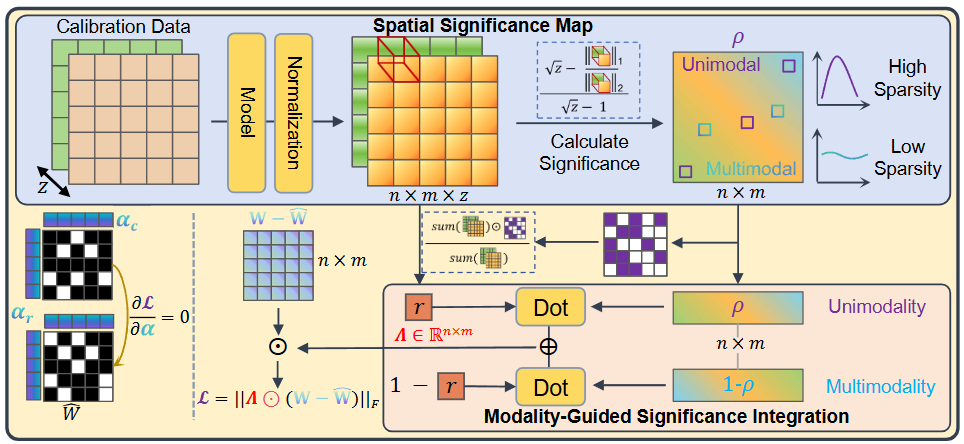
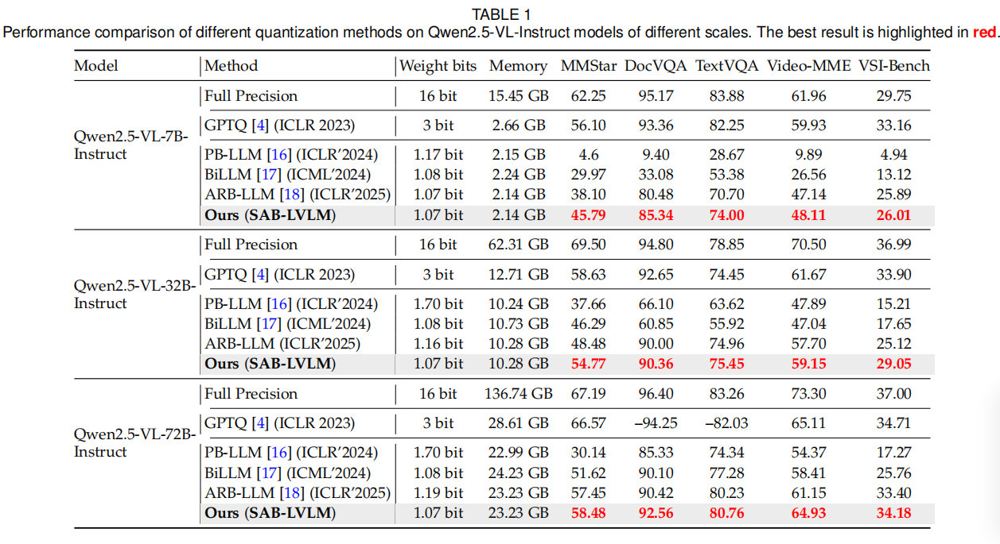
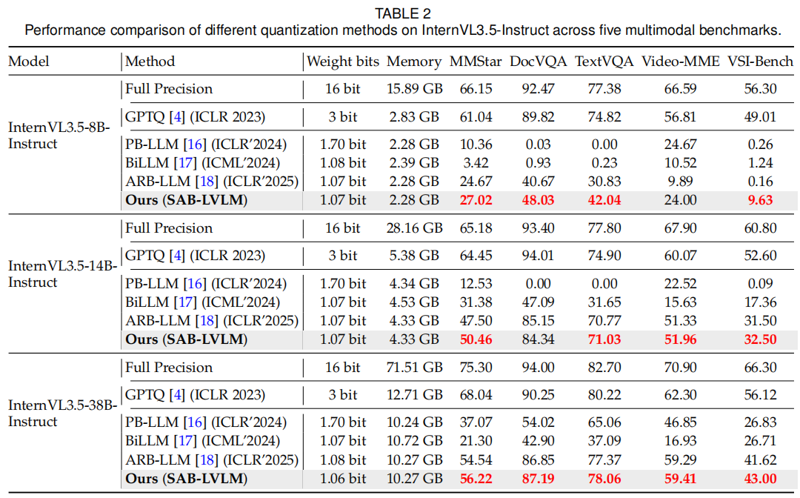

# SAB-LVLM: Significance-Aware Binarization for Large Vision-Language Models

<!--
README template for open-sourcing SAB-LVLM.
Replace all placeholders wrapped by <...>, and delete template notes before release.
-->

<p align="center">
  <a href="<PAPER_URL>"></a>
  <a href="<PROJECT_PAGE_URL>"></a>
  <a href="<LICENSE_URL>"></a>
</p>

<p align="center">
  <strong>SAB-LVLM: Significance-Aware Binarization for Large Vision-Language Models</strong>
</p>

<p align="center">
  Qi Lyu<sup>1,2,3,*</sup>,
  Jiahua Dong<sup>4,*</sup>,
  Baichen Liu<sup>1,2</sup>,
  Xudong Wang<sup>1,2,3</sup>,
  Mingfei Han<sup>4</sup>,
  Yulun Zhang<sup>5</sup>,
  Fahad Shahbaz Khan<sup>4</sup>,
  Salman Khan<sup>4</sup>,
  Lianqing Liu<sup>1,2</sup>,
  and Zhi Han<sup>1,2</sup>
</p>

<p align="center">
  <sup>1</sup>State Key Laboratory of Robotics and Intelligent Systems<br>
  <sup>2</sup>Shenyang Institute of Automation, Chinese Academy of Sciences<br>
  <sup>3</sup>University of Chinese Academy of Sciences<br>
  <sup>4</sup>Mohamed bin Zayed University of Artificial Intelligence<br>
  <sup>5</sup>Shanghai Jiao Tong University<br>
  <sup>*</sup>Equal contribution
</p>

---

## 🔥 News

- **2026-06-28**: Paper is released.
- **2026-06-28**: Code is released.

---

## 📌 Abstract

Large Vision-Language Models (LVLMs) have achieved remarkable progress in multimodal understanding, yet their enormous parameter scale and cross-modal computation incur substantial memory and latency overhead, severely limiting real-world deployment on resource-constrained devices.
Binarization offers an attractive solution by drastically reducing storage and computational costs. However, existing binarization methods neglect the varying importance of weights across different layers and modalities. This causes parameters irrelevant to downstream tasks to be unnecessarily retained, whereas modality-critical weights may not be adequately optimized, resulting in significant performance degradation.
To address these challenges, we develop a novel <u>S</u>ignificance-<u>A</u>ware <u>B</u>inarization for <u>L</u>arge <u>V</u>ision-<u>L</u>anguage <u>M</u>odels, namely SAB-LVLM.
Specifically, after constructing Hessian matrices for textual and visual inputs, we propose a spatial significance map to distinguish full-precision weights activated under a single modality from those activated across modalities.
We then devise a modality-guided integration strategy to obtain the significance-aware binarization map, which measures weight significance across layers and modalities.
Subsequently, this binarization map is incorporated into the binarization objective as an error reweighting term, and binarization fitting is performed through an alternating significance-weighted update scheme.
Extensive experiments illustrate the superiority of our SAB-LVLM over existing binary PTQ methods under an approximately 1-bit compression constraint.

<p align="center">
  
</p>

<p align="center">
  <em>Figure 1. Overview of SAB-LVLM.</em>
</p>

---
## Dependencies

```bash
# Clone the github repo and go to the default directory.
git clone https://github.com/LyuQi127/SAB_LVLM
cd SAB_LVLM

conda create -n sab-lvlm python=3.11
conda activate sab-lvlm
pip install torch torchvision torchaudio
pip install -r requirements.txt
```
---
## Post-training quantization

### Binarization for Qwen2.5-VL families

  ```shell
  python3 run_arb_mllm_for72B.py Qwen/Qwen2.5-VL-7B-Instruct c4 arb-rc \
    --blocksize 128 \
    --salient_metric hessian \
    --device "cuda:0" \
    --save \
    --num_p 1 \
    --order2_group \
    --nsamples 128 \
    --mllm_quant \
    --adaptive_omega \
    --salient_top_p 0.05 \
    --diff_quantile 0.5 \
    --sparsity_thr 0.005 \
    --rc_iter 15 \
  ```
  ### Binarization for InternVL families

  ```shell
  python3 run_arb_mllm4.py OpenGVLab/InternVL3_5-14B-Instruct c4 arb-rc \
    --blocksize 128 \
    --salient_metric hessian \
    --device "cuda:0" \
    --save \
    --num_p 1 \
    --order2_group \
    --nsamples 128 \
    --mllm_quant \
    --adaptive_omega \
    --salient_top_p 0.05 \
    --diff_quantile 0.5 \
    --sparsity_thr 0.005 \
    --rc_iter 15
  ```

---
## 🔎 Results

<details>
<summary>SAB-LVLM: achieves better performance on MMStar/DocVQA/TextVQA/VideoMME/VSIBench benchmarks. (click to expand)</summary>

- Qwen 2.5 VL family
<p align="center">
  
</p>
<p align="center">
  
</p>

- InternVL 3.5 families
<p align="center">
  
</p>
<p align="center">
  
</p>
</details>

---

## 🙏 Acknowledgements

This codebase builds upon the excellent work of:

- [ARB-LLM](https://github.com/ZHITENGLI/ARB-LLM)
- [lm-evaluation-harness](https://github.com/EleutherAI/lm-evaluation-harness)

---

## 📄 License

This work is released under the Apache 2.0 license. The codes are based on BiLLM. Please also follow their licenses. Thanks for their awesome works.
